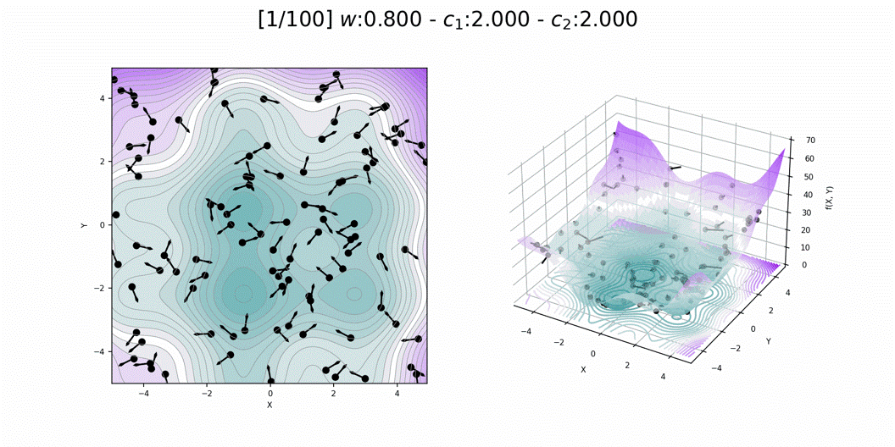
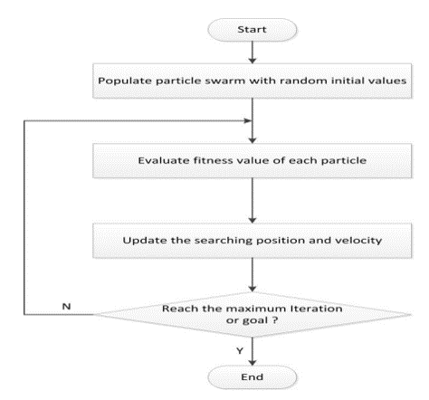

# Particle swarm optimization(PSO) explain
Particle Swarm Optimization (PSO) is an optimization method whereas multiple particles as possible candidate searching in the solution space based on their own global and local best known positions. This is inspired by the social behavior of bird flocks where individuals coordinate their movements based on local information and behavior of their neighbors. 
PSO does not require that the objective function be differentiable and can optimize over very large problem spaces, but is not guaranteed to converge.

# Params
Its similar to genetic algorithm (GA) but no evolution operators such as crossover and mutation
Each particles = populations
Each particles have their own speed in which determine the next new position of the corresponding particle in next generation
Both particle (P) and velocity (V) are in vector space
Objective function (some say fitness function) used to define Gbest & Pbest
Gbest = the global best performed particle in the all iterations
Pbest = the local best performed particle of itself along the generations
velocity (V) is updated according to Gbest and Pbest with certain randomness in which pushing the particle toward aforementioned position in order to update next new position of particles

## PSO showcase
 

## Flow chart of PSO
 

## Reference
[Arterial_traffic_signal_optimization_using_Particle_Swarm_Optimization_in_an_integrated_VISSIM-MATLAB_simulation_environment](https://ieeexplore.ieee.org/document/7795641) 
[Swarm intelligence for traffic light scheduling Application to urban areas](https://www.sciencedirect.com/science/article/abs/pii/S0952197611000777) 
[Traffic signal control based on particle swarm optimization](https://www.researchgate.net/publication/287022845_Traffic_signal_control_based_on_particle_swarm_optimization) 
[G. Sermpinis, K. Theofilatos, A. Karathanasopoulos, E. F. Georgopoulos, & C. Dunis, Forecasting foreign exchange rates with adaptive neural networks using radial-basis functions and Particle Swarm Optimization, European Journal of Operational Research.](https://econpapers.repec.org/article/eeeejores/v_3a225_3ay_3a2013_3ai_3a3_3ap_3a528-540.htm) 
[Clerc, M., and J. Kennedy. The Particle Swarm — Explosion, Stability, and Convergence in a Multidimensional Complex Space. IEEE Transactions on Evolutionary Computation 6, no. 1 (February 2002): 58–73.](https://ieeexplore.ieee.org/document/985692) 

